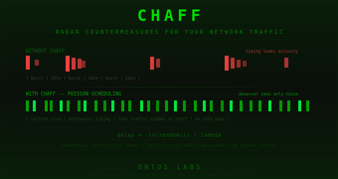

<p align="center">
  
</p>

# chaff

**Stochastic traffic padding proxy — radar countermeasures for your network traffic.**

Everyone in network security acknowledges that encrypted traffic still leaks metadata through packet sizes, timing patterns, and activity gaps. VPNs, TLS, and Tor protect content — they don't protect *when* you're talking, *how much* you're sending, or *how long* you're silent.

Everyone acknowledges it. Nobody ships a usable tool.

chaff does.

## How It Works

chaff is a local SOCKS5 proxy that sits between your applications and your upstream connection (VPN, Tor, or raw internet). It does three things:

1. **Pads all packets** to a fixed size (default: 1500 bytes MTU) with `os.urandom` fill. After padding, real and chaff packets are byte-identical in structure.

2. **Schedules all outbound traffic** on a Poisson stochastic timeline. The key insight: constant-rate padding is itself a detectable fingerprint — real traffic is bursty. Poisson inter-arrival times (`delay = -ln(U) / λ`) produce exponential distributions statistically indistinguishable from organic network events.

3. **Fills empty slots with chaff** — pure random packets indistinguishable from padded real data. An observer sees a continuous stream of fixed-size blobs at natural-looking intervals regardless of actual traffic.

```
App → chaff SOCKS5 → [padder + scheduler] → VPN/Tor → Internet
                          ↑
              Poisson-distributed chaff fills gaps
```

## Current Status: Proof of Concept

chaff v0.1 is a **working PoC** — the SOCKS5 proxy, Poisson scheduler, padder, and stats engine are all functional and tested. You can browse through it right now.

However, in the default **null sink** mode, chaff packets are generated locally but never traverse the wire. This means the timing mask exists only inside the proxy — an observer on your upstream link still sees your real traffic at its real timing.

**For operational traffic cover**, chaff packets need to actually leave your box. This requires either:
- A **reflector** — a simple UDP echo server on a cheap VPS (~$3/month) that bounces chaff packets back, creating observable bidirectional noise on the wire
- A **paired** setup — two chaff instances pointed at each other

Reflector and paired modes are specced but not yet implemented. Contributions welcome.

## Roadmap to Operational

v0.1 proves the concept. To get real cover on the wire, you need a **cooperative endpoint** that accepts chaff packets — because firing random noise at real servers gets you blocked, not protected.

**The reflector is 12 lines of Python on a cheap VPS:**

```python
import socket
s = socket.socket(socket.AF_INET, socket.SOCK_DGRAM)
s.bind(("0.0.0.0", 9999))
while True:
    data, addr = s.recvfrom(2048)
    s.sendto(data, addr)
```

That's it. A ~$3/month VPS that bounces whatever you throw at it. On the wire it looks like a continuous bidirectional UDP conversation — indistinguishable from VoIP or a game session. Your real browsing traffic is buried in the Poisson noise stream to the reflector.

Even better: if you already RDP into a box, run the reflector there. The chaff traffic blends into your existing RDP session — no new connections to explain.

**v0.2 targets:** Reflector mode (chaff traverses the wire), connection pooling (mask TCP handshake bursts), Firefox QUIC/WebRTC hardening guidance.

**What works right now:**
- Full SOCKS5 proxy with Poisson-scheduled packet padding
- Real traffic displaces chaff in existing Poisson slots (rate stays constant)
- 12/12 unit tests passing (scheduler distribution, padding, stats)
- Honest real-time stats showing chaff/real ratio, rate, bandwidth
- Accidentally useful as a DNS-bypassing SOCKS5 proxy (seriously fast through VPN stacks)

## Quick Start
pip install chaff
chaff --rate 100 --mode poisson
```

Configure your browser or application to use `socks5://127.0.0.1:1080` as its proxy.

## Usage

```bash
# Default: Poisson scheduling, 100 pkt/s, null sink, dashboard on :8080
chaff

# Higher rate, no dashboard
chaff --rate 200 --no-dashboard

# With a reflector VPS for bidirectional cover
chaff --sink reflector --reflector-host your-vps.example.com

# Jittered mode (simpler, less robust)
chaff --mode jittered --rate 50

# Verbose logging
chaff -v
```

## Why Poisson, Not Constant-Rate

A perfectly uniform 100 pkt/s stream is itself a screaming fingerprint. Real network traffic is bursty — web requests come in bursts, idle gaps vary, background services fire at irregular intervals. Any constant-rate stream is trivially identifiable by a patient observer.

The Poisson process models the natural arrival pattern of independent network events. The inter-arrival times follow an exponential distribution where the mean converges to the target rate but individual gaps vary naturally. This is how real network events distribute — making a Poisson-scheduled chaff stream statistically indistinguishable from organic traffic at any observation window.

## Sink Modes

| Mode | Description | Setup |
|------|-------------|-------|
| `null` | Fire-and-forget. Chaff packets vanish. Zero config. | Default — just run it |
| `reflector` | VPS echo server bounces packets back. Bidirectional cover. | Requires a simple UDP echo on your VPS |
| `paired` | Two chaff instances pad each other. Maximum cover. | Two hosts running chaff pointed at each other |

## Honest Threat Model

chaff is an **engineering mitigation**, not a cryptographic proof. Here's exactly what it does and doesn't do:

**Does mitigate:**
- Passive traffic timing analysis (packet inter-arrival patterns)
- Activity detection (are they online? are they active?)
- Volume correlation (burst size → content type inference)
- Idle gap fingerprinting

**Does not mitigate:**
- Active probing attacks (an adversary sending crafted traffic to your proxy)
- Application-layer leaks (DNS, WebRTC, QUIC bypass)
- Kernel-level traffic analysis (requires OS integration, not userspace proxy)
- Endpoint compromise (if they're on your box, chaff is irrelevant)
- Global adversaries with traffic correlation across multiple vantage points

**Bandwidth cost:** ~1.2 Mbps at Poisson(100) with 1500-byte packets. Adjust `--rate` and `--pad-size` to taste.

## Red Team Notes (v0.1 Honest Assessment)

We red-teamed our own tool. Here's what survives scrutiny and what doesn't:

**Connection count correlation** — chaff masks data timing but NOT TCP handshake bursts. When you load a page, 15-30 new connections open in a 2-second burst. An observer counting SYN packets knows when you started browsing. Fix: connection pooling (v0.2).

**Asymmetric traffic** — chaff pads outbound only. Inbound responses arrive unpadded at server-determined timing. The asymmetry is detectable. Fix: reflector mode creates bidirectional cover.

**Null sink limitation** — the big one. Chaff packets currently go to `/dev/null` locally. They never traverse the wire. The Poisson timing mask is local-only until reflector/paired mode is implemented. This is why v0.1 is a PoC, not operational cover.

**QUIC bypass** — HTTP/3 (QUIC) traffic bypasses SOCKS5 entirely. Disable in Firefox: `about:config` → `network.http.http3.enabled` → `false`.

**WebRTC leaks** — if WebRTC is enabled, STUN/TURN queries can bypass the proxy. Disable: `about:config` → `media.peerconnection.enabled` → `false`.

**TLS fingerprinting** — Python's ssl module has a different JA3 fingerprint than Firefox. A sophisticated observer could distinguish proxy-originated connections. Nation-state level concern only.

We built this to be honest about its limitations. If someone tells you their traffic padding tool has no attack vectors, they're lying.

## Architecture

```
chaff/
├── __init__.py          # Package metadata
├── config.py            # Dataclass config, enums, defaults
├── engine.py            # Poisson scheduler, padder, packet queue
├── stats.py             # Sliding window statistics, histogram
├── proxy.py             # Async SOCKS5 handler, sink, server
└── cli.py               # CLI entry point
```

Pure Python. Zero compiled dependencies. asyncio throughout. Designed to sit in front of any upstream transport.

## Development

```bash
git clone https://github.com/ash23x/chaff
cd chaff
pip install -e ".[dev]"
pytest
```

## Why "chaff"?

Named after radar countermeasures — metallic strips dropped from aircraft to confuse radar returns by creating a cloud of false echoes indistinguishable from the real target. Same principle, different domain.

## License

MIT — Greg Ashley / [Ontos Labs Ltd](https://github.com/ash23x)
